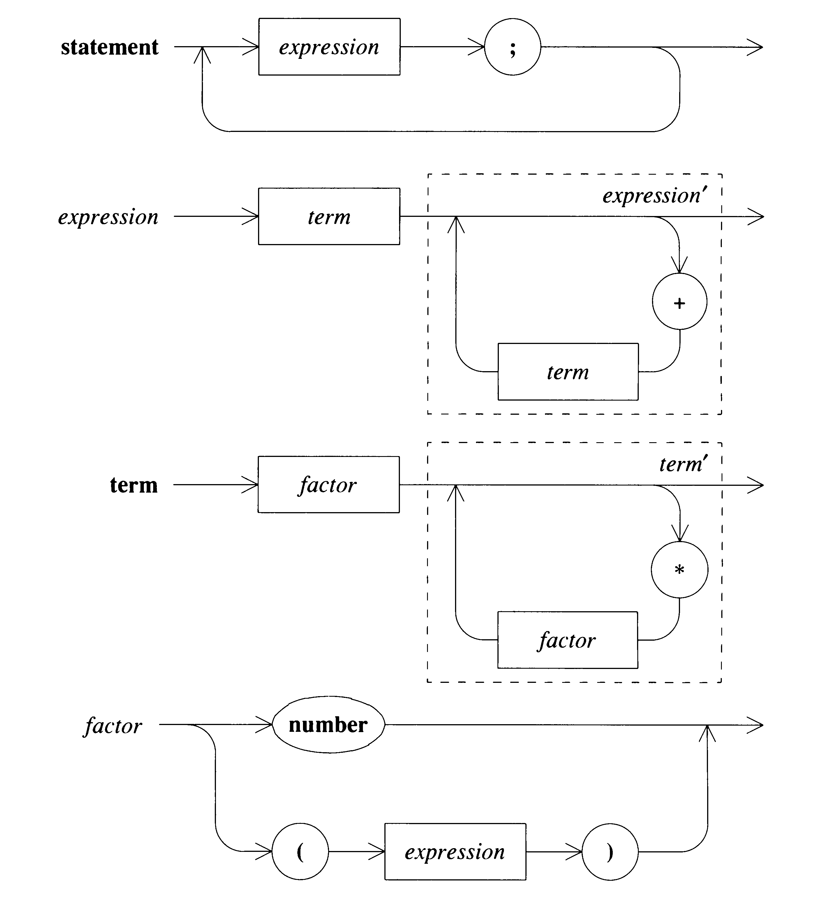

Grammar:

- statements -> expression; EOI | expression; statement

- expression -> term expression'
- expression' -> + term expression' | E

- term -> factor term'
- term' -> * factor term' | E

- factor -> NUM_OR_ID | (expression)

Parser.c contain naive parser. NewParser.c is an improved version in which:
- all the right recursion-productions in which the left-hand side also appears at the far right of the right-hand side-can be replaced by loops: If the last thing that a subroutine does is call itself, then that recursive call can be replaced by a loop.
- an error recovery is added
- merging together of productions can be applied to the subroutines that implement these productions.

